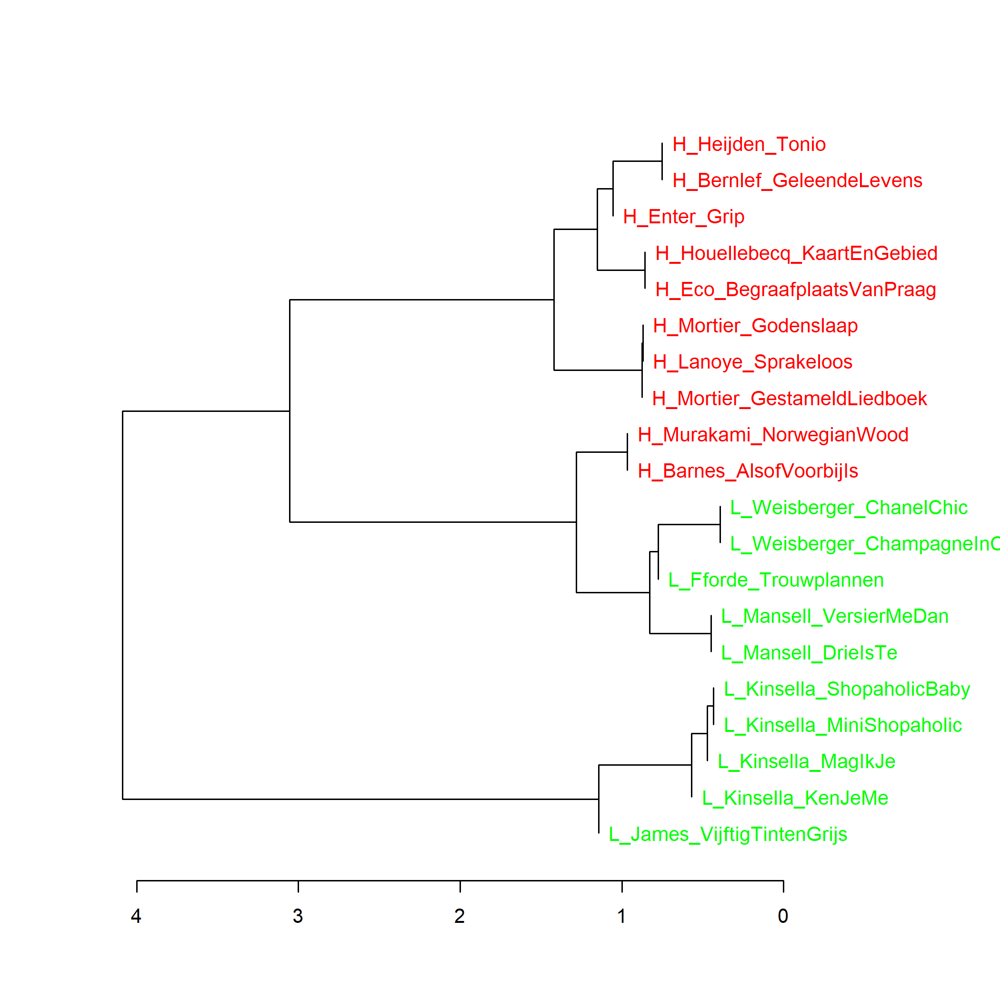

Grafiek 4.5: De 10 romans met de hoogste en laagste scores voor literaire kwaliteit, clusteranalyse (**100** meest frequente woorden), kleurenversie van grafiek 4.5, p. N in *Het raadsel literatuur*. Maat: Classic Delta (de Deltascore staat aangegeven onder de horizontale as)

Extra grafieken:

Grafiek 4.5.1:  De 10 romans met de hoogste en laagste scores voor literaire kwaliteit, analyse op hoofdcomponenten (**100** meest frequente woorden). Met een principal components analyse kunnen we zien hoe de teksten zich tot elkaar verhouden op de eerste (horizontaal afgebeelde) en tweede (verticaal afgebeelde) component.

Grafiek 4.5.2:  De 10 romans met de hoogste en laagste scores voor literaire kwaliteit, clusteranalyse (**130** meest frequente woorden). Vanaf dit aantal MFWs (meest frequente woorden) zijn de 10 hoogst en laagst gewaardeerde romans elk in hun eigen cluster te vinden. Bij 120 MFWs zien we hetzelfde beeld als in Grafiek 4.5.

