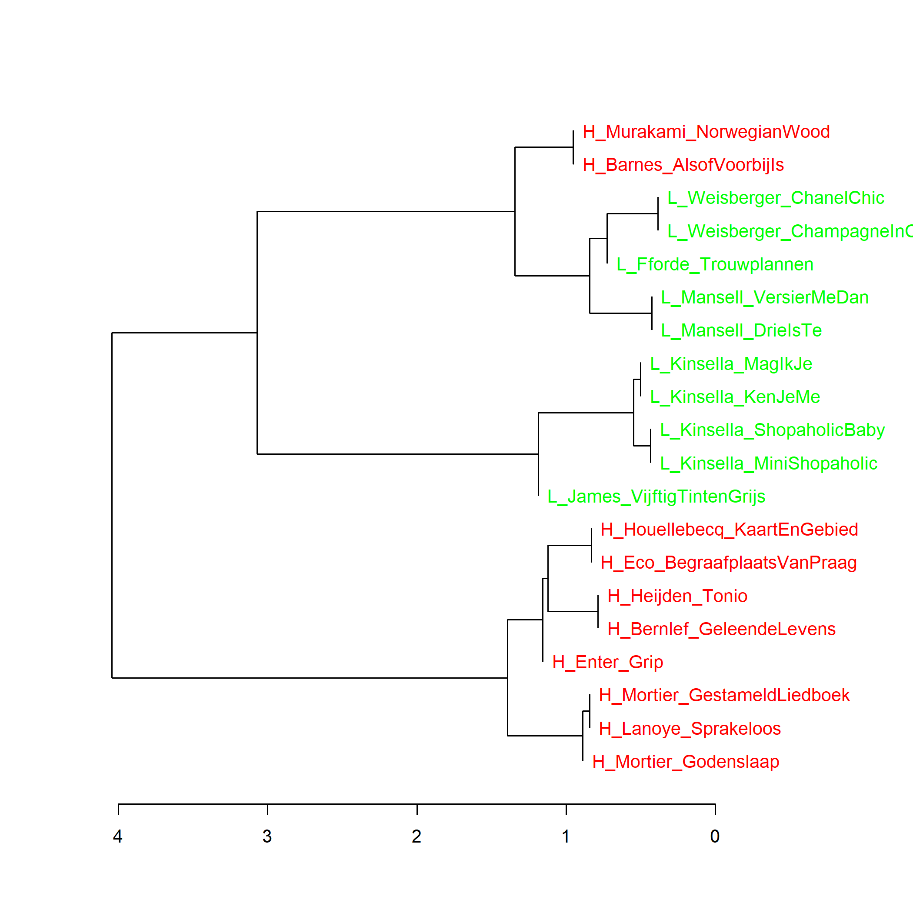
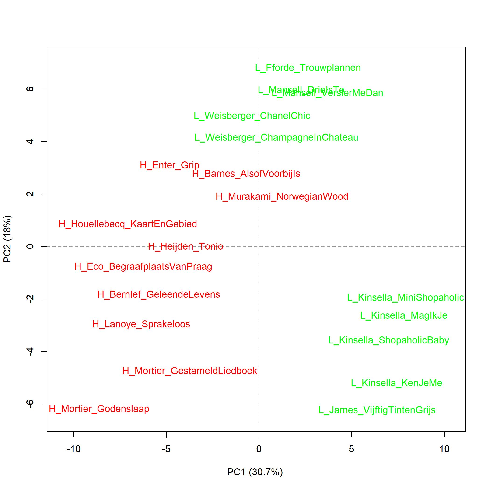
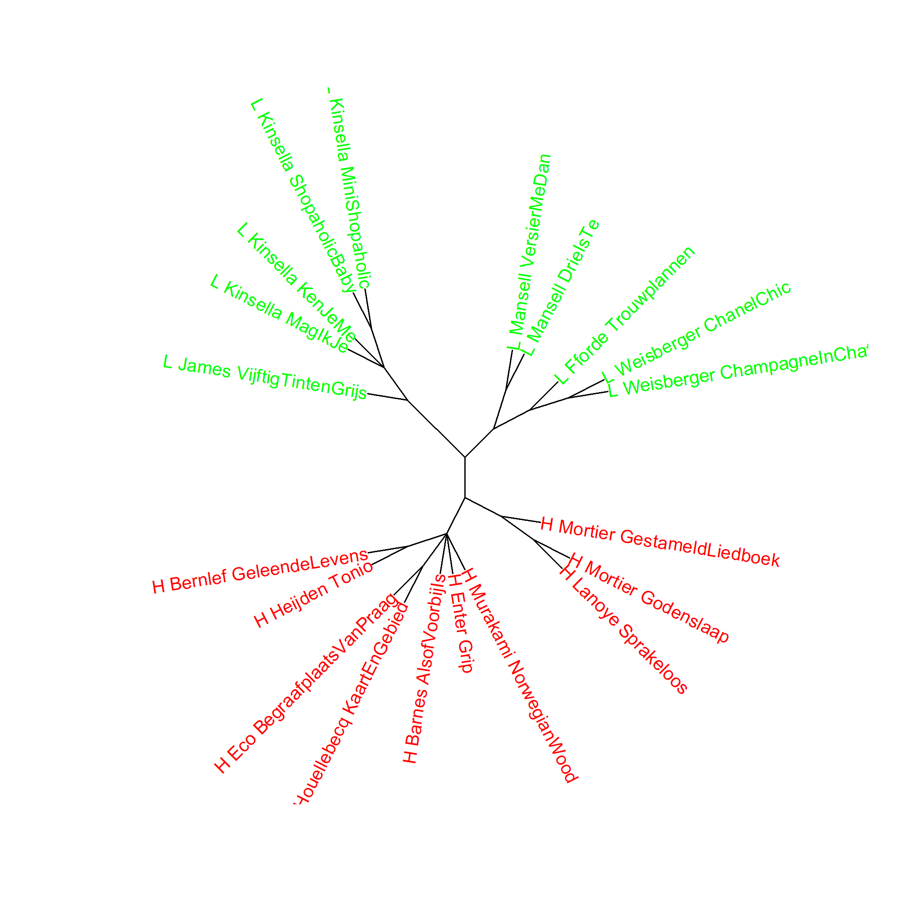

De 10 romans met de hoogste en laagste scores voor literaire kwaliteit, clusteranalyse (**100** meest frequente woorden), kleurenversie van grafiek 4.5, p. N in *Het raadsel literatuur*. Maat: Classic Delta (de Deltascore staat aangegeven onder de horizontale as)

**Extra grafieken:**

**Grafiek 4.5.1**

De 10 romans met de hoogste en laagste scores voor literaire kwaliteit, analyse op hoofdcomponenten (**100** meest frequente woorden, MFW). Met een principal components analyse kunnen we zien hoe de teksten zich tot elkaar verhouden op de eerste (horizontaal afgebeelde) en tweede (verticaal afgebeelde) component.

**Grafiek 4.5.2**

De 10 romans met de hoogste en laagste scores voor literaire kwaliteit, clusteranalyse (**130** meest frequente woorden). Vanaf dit aantal MFW) zijn de 10 meest literair gevonden romans steeds bij elkaar in hetzelfde cluster te vinden. De weinig literair gewaardeerde romans van Weisberger, Fforde en Mansell lijken net iets meer op de 10 meest literaire romans dan op de andere 5 romans, van Kinsella en James. Bij 110 en 120 MFW zien we hetzelfde beeld als in Grafiek 4.5.

**Grafiek 4.5.3**

De 10 romans met de hoogste en laagste scores voor literaire kwaliteit, bootstrap consensus tree: het gemiddelde van clusteranalyses gemaakt op basis van de **100** MFW tot en met de **1000** MFW met een increment van 100 en een consensus strength van 0,5.

**Grafiek 4.5.4**

De 10 romans met de hoogste en laagste scores voor literaire kwaliteit, analyse op hoofdcomponenten (**1000** meest frequente woorden).

