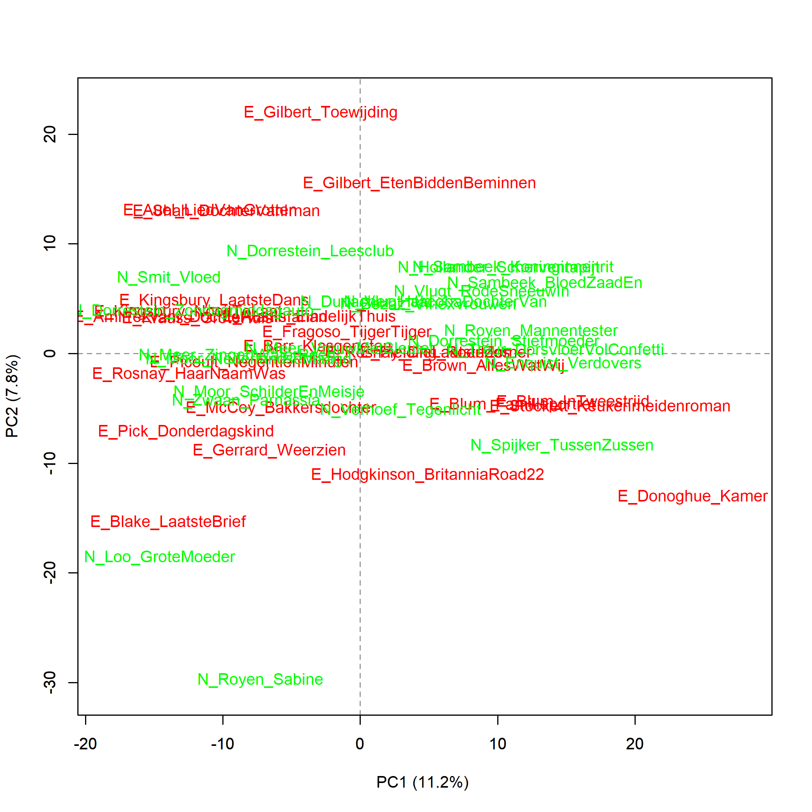
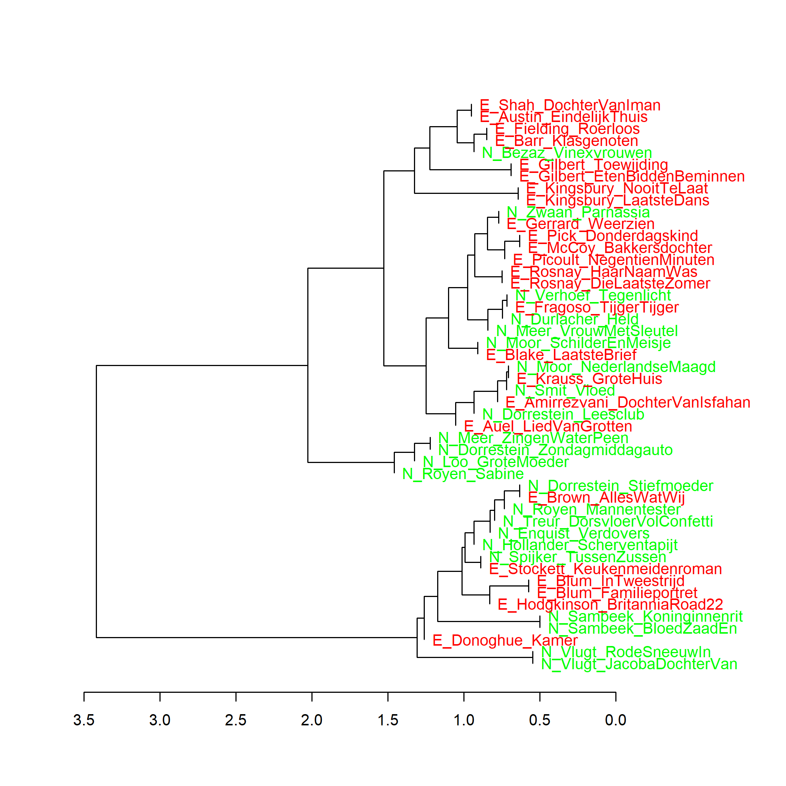
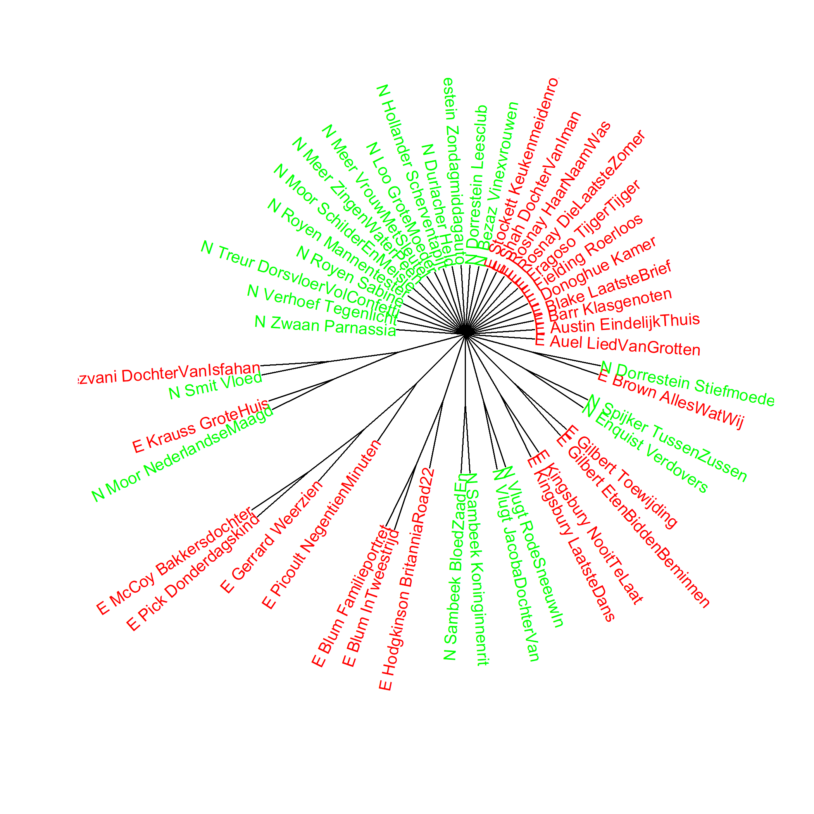

Kleurenversie van de grafiek op p. 117 van *Het raadsel literatuur*.

Nederlandse en uit het Engels vertaalde literaire romans van vrouwelijke auteurs, analyse op
hoofdcomponenten (1000 meest frequente woorden). Maat: PCA, correlatieversie.

### **Extra grafieken Nederlandse en uit het Engels vertaalde literaire romans van vrouwelijke auteurs**
Alle gemaakt met het Stylo Package for R. Zie voor meer informatie over package en de verschillende maten deze website onder Grafiek 4.5.

In Grafiek 6.1 is te zien dat de Nederlandse en uit het Engels vertaalde literaire romans van vrouwelijke auteurs in het frequentiegebruik van de 1000 meest gebruikte woorden niet als twee verschillende clusters in de visualisatie verschijnen. Ook een clusteranalyse (Grafiek 6.1.1 hieronder) en een bootstrap consensus tree (Grafiek 6.1.2 hieronder) op basis van 1000 meest frequente woorden presenteren hetzelfde beeld.

**Grafiek 6.1.1 Nederlandse en uit het Engels vertaalde literaire romans van vrouwelijke auteurs**
Clusteranalyse (**1000** meest frequente woorden). Maat: Classic Delta.

**Grafiek 6.1.2 Nederlandse en uit het Engels vertaalde literaire romans van vrouwelijke auteurs**

Bootstrap consensus tree (**100** - **1000** meest frequente woorden, increment van 100, consensus strength 0.5). Maat: Classic Delta.

