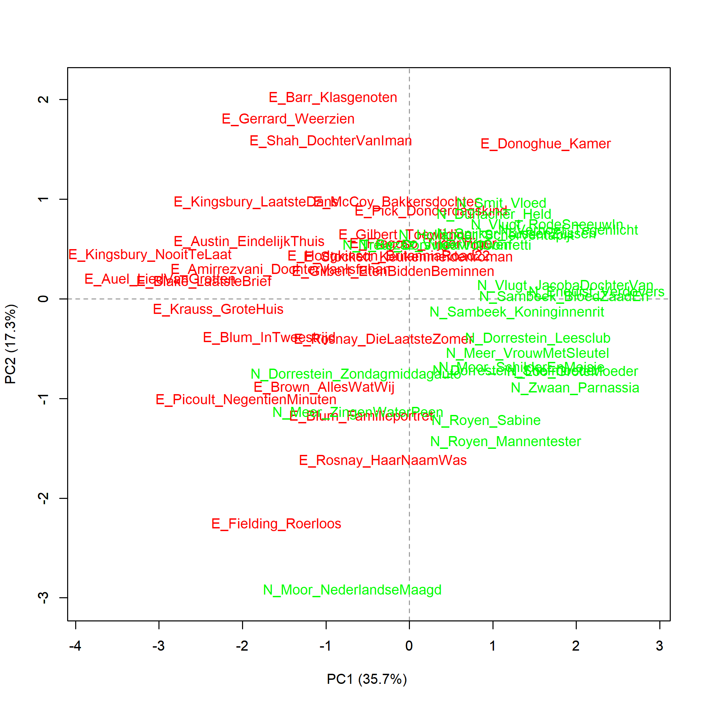
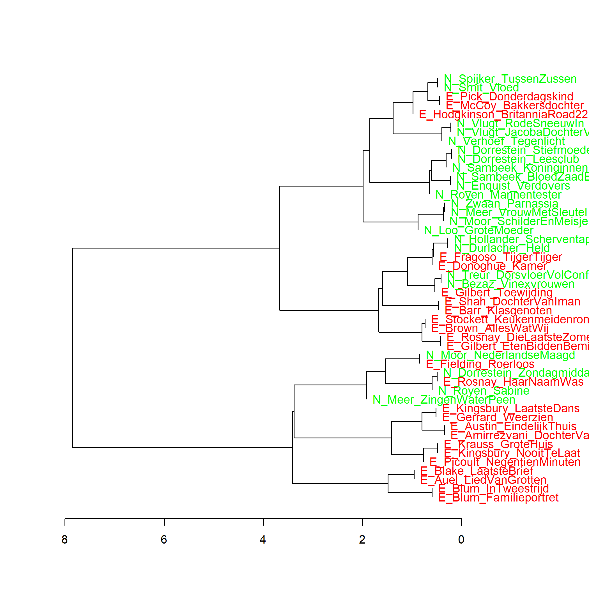

Kleurenversie van de grafiek op p. 118 van *Het raadsel literatuur*.

De voegwoorden *en*, *toen*, *dat*, *voordat*, *terwijl* en *hoewel* in de Nederlandse (N) en uit het Engels
vertaalde (E) literaire romans van vrouwelijke auteurs, analyse op hoofdcomponenten. Maat: PCA, correlatieversie.

### **Extra grafiek Voegwoorden in Nederlandse en uit het Engels vertaalde literaire romans van vrouwelijke auteurs**
Ook deze grafiek is gemaakt met het Stylo Package for R. Zie voor meer informatie over package en de verschillende maten deze website onder Grafiek 4.5.

**Grafiek 6.2.1 Voegwoorden in Nederlandse en uit het Engels vertaalde literaire romans van vrouwelijke auteurs**

De voegwoorden *en*, *toen*, *dat*, *voordat*, *terwijl* en *hoewel* in de Nederlandse (N) en uit het Engels
vertaalde (E) literaire romans van vrouwelijke auteurs, analyse op hoofdcomponenten. Clusteranalyse (**1000** meest frequente woorden). Maat: Classic Delta.

