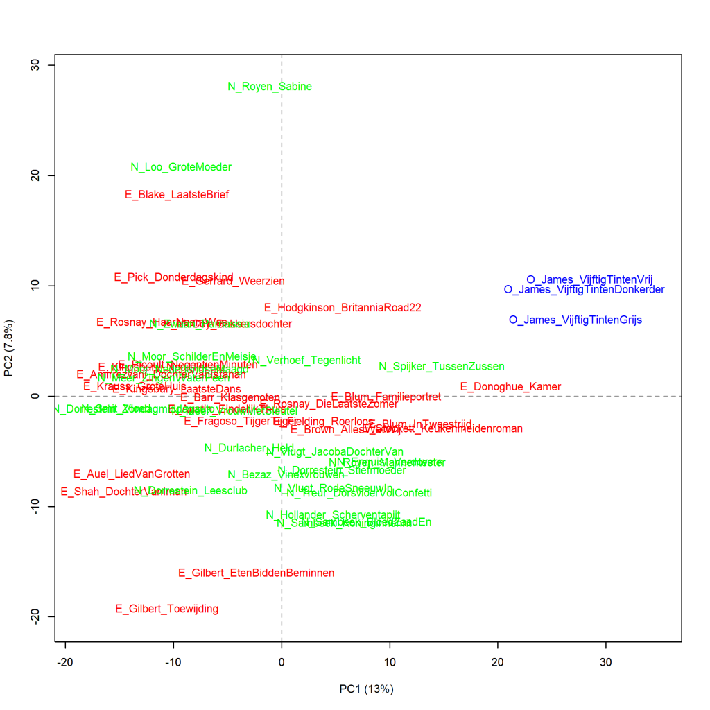
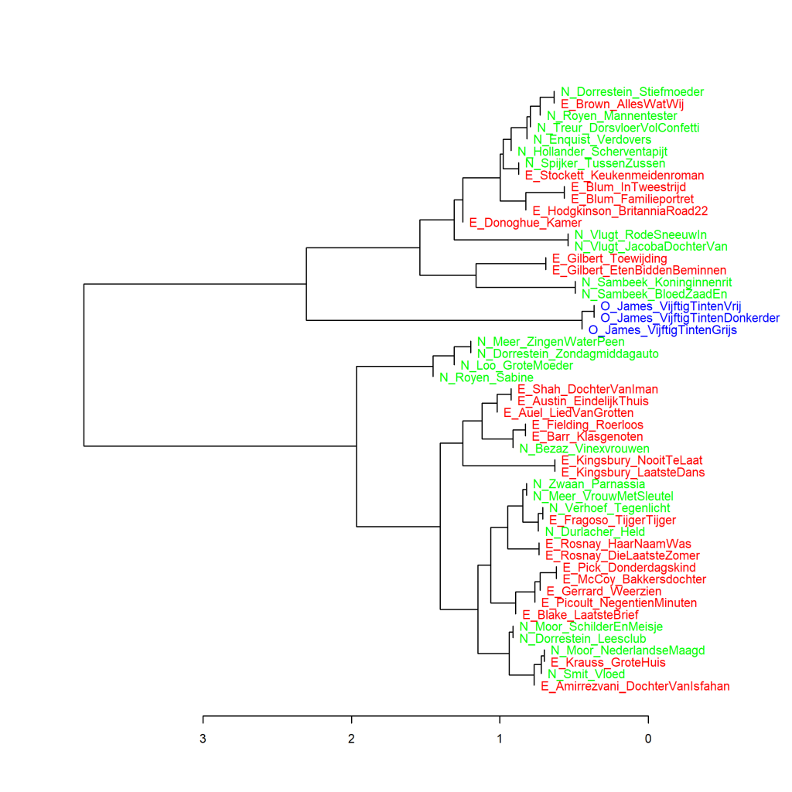
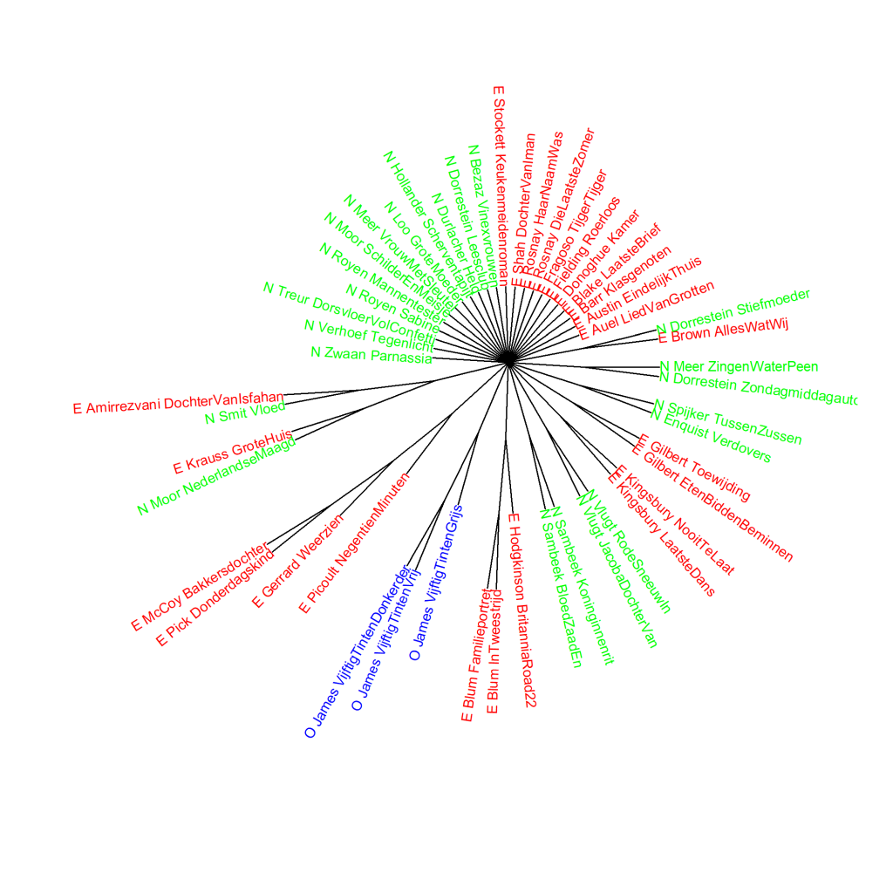
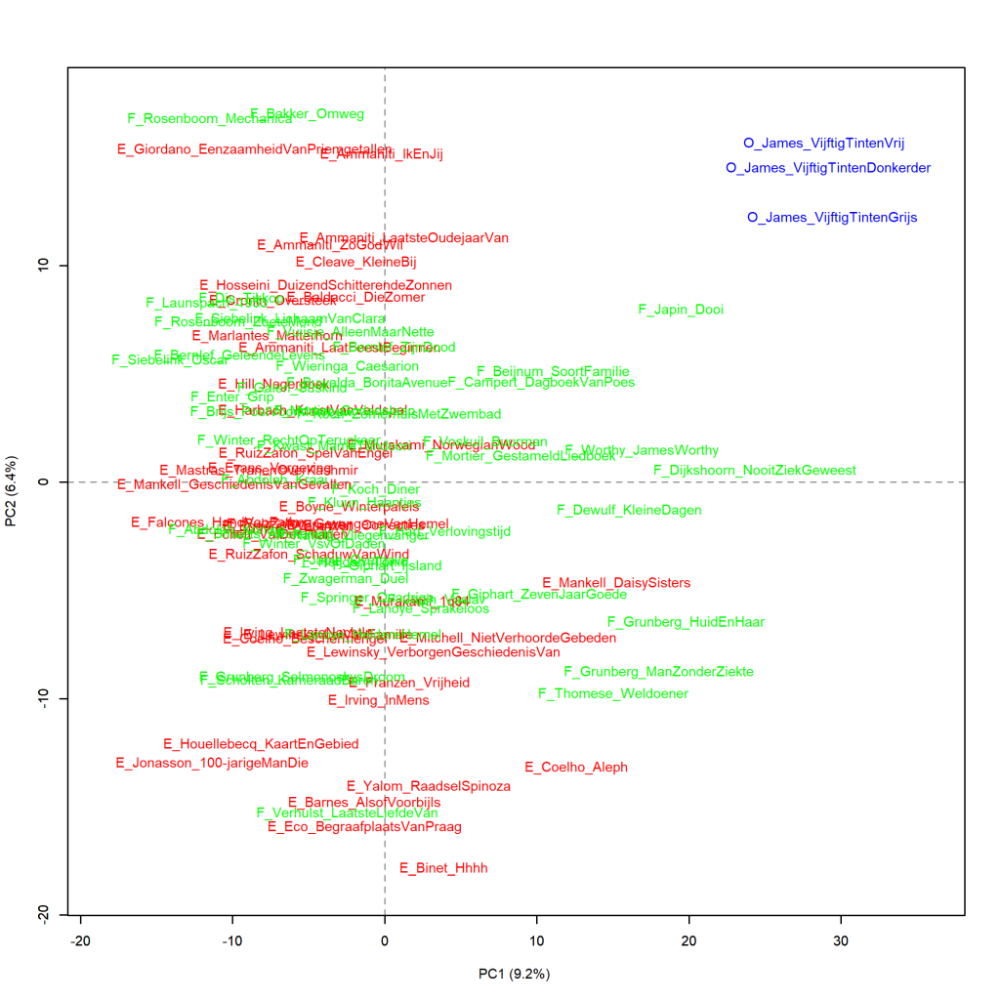
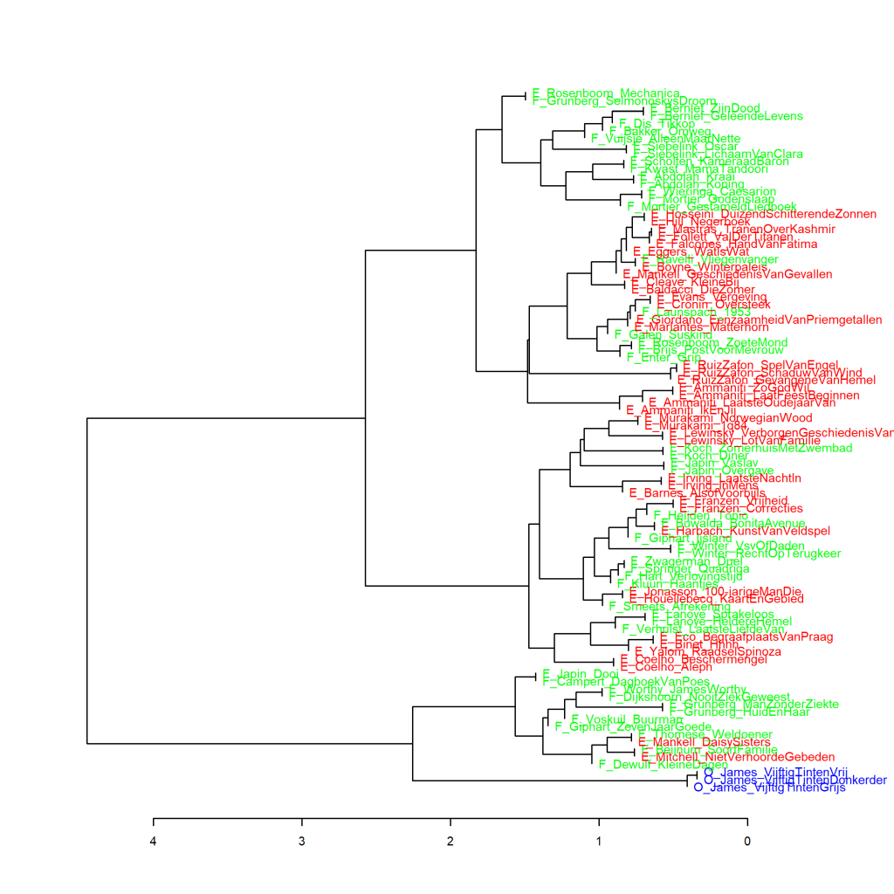
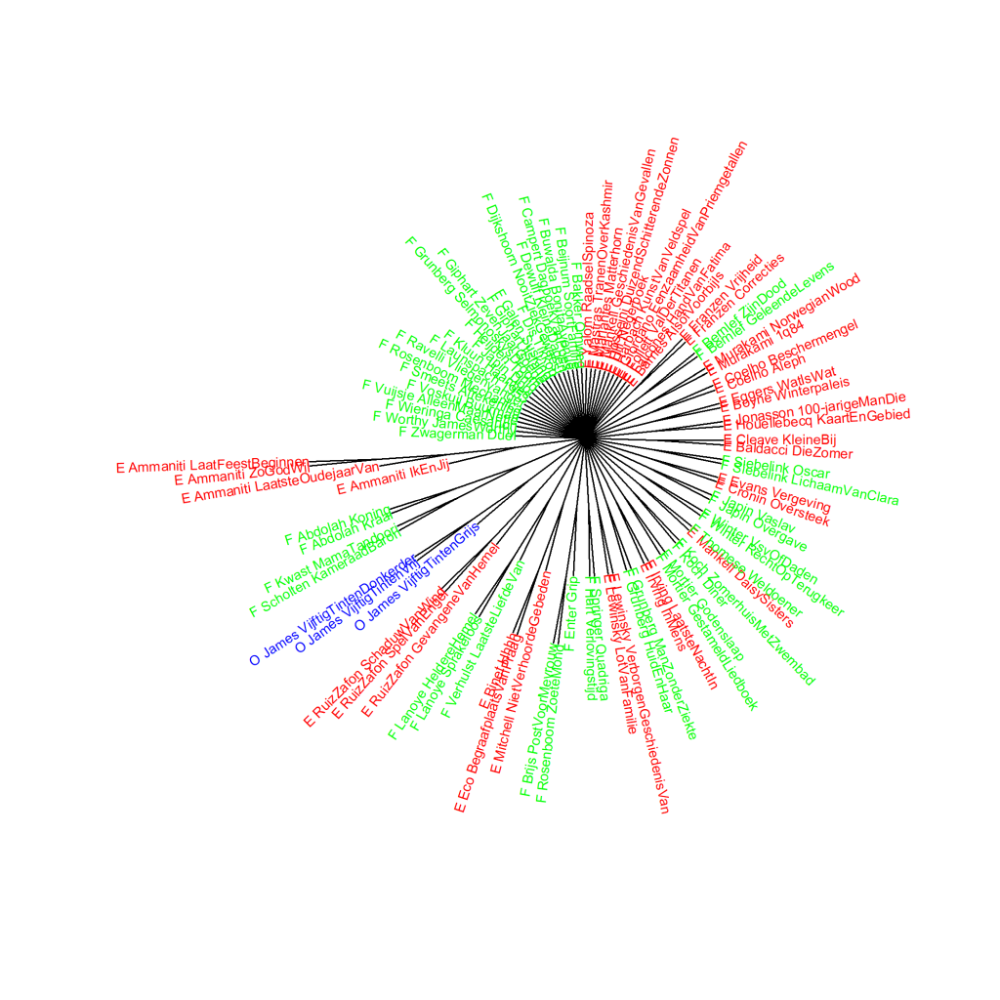

Extra grafieken bij p. 245-247 van *Het raadsel literatuur*.

Ook deze grafieken zijn gemaakt met het Stylo Package for R. Zie  Grafiek 4.5 voor meer informatie over het package en de verschillende maten.

**Grafiek 9.3.6 Vijftig tinten en Literaire romans geschreven door vrouwen**

Uit het Engels vertaalde romans staan weergegeven met een E_ voor de auteur en verkorte titel, en oorspronkelijk Nederlandstalige romans zijn aangeduid met N_. De O_ voor de Vijftig tinten-trilogie staat voor Overig. Maat: PCA, correlatieversie.

**Grafiek 9.3.7 Vijftig tinten en Literaire romans geschreven door vrouwen**

Clusteranalyse (**1000** meest frequente woorden). Maat: Classic Delta.

**Grafiek 9.3.8 Vijftig tinten en Literaire romans geschreven door vrouwen**

Bootstrap consensus tree (**100** - **1000** meest frequente woorden, increment van 100, consensus strength 0.5). Maat: Classic Delta.

**Grafiek 9.3.9 Vijftig tinten en Literaire romans geschreven door mannen**

Uit het Engels vertaalde romans staan weergegeven met een E_ voor de auteur en verkorte titel, en oorspronkelijk Nederlandstalige romans zijn aangeduid met N_. De O_ voor de Vijftig tinten-trilogie staat voor Overig. Maat: PCA, correlatieversie.

**Grafiek 9.3.10 Vijftig tinten en Literaire romans geschreven door mannen**

Clusteranalyse (**1000** meest frequente woorden). Maat: Classic Delta.

**Grafiek 9.3.11 Vijftig tinten en Literaire romans geschreven door mannen**

Bootstrap consensus tree (**100** - **1000** meest frequente woorden, increment van 100, consensus strength 0.5). Maat: Classic Delta.

**Conclusie**

NOG AANPASSEN

De *Vijftig tinten*-trilogie staat verder af van de spannende boeken uit het onderzoekscorpus die zijn geschreven door mannelijke auteurs dan van die van de hand van vrouwelijke auteurs (zie bijvoorbeeld de Delta score in Grafiek 9.3.4 onder de grafiek ter hoogte van de plaats waar de trilogie samenclustert met een zestal spannende boeken). Wat verder opvalt in deze extra grafieken is dat de Nederlandse en vertaalde spannende boeken goed gemengd voorkomen, terwijl er in de analyses van de spannende boeken van vrouwen een veel groter verschil lijkt te zijn tussen Nederlandseen vertaalde titels. Meer hierover in *Het raadsel literatuur* op p. 245-247.

**Hoe zijn de metingen te repliceren?**
